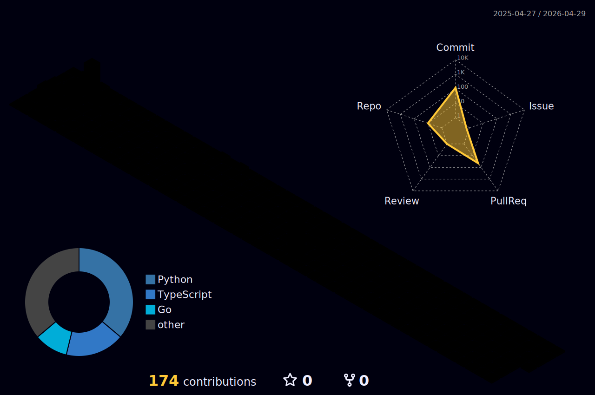

[.;+;%E2%9C%A8+Thanks+for+visiting+my+GitHub+%E2%9C%A8)](https://git.io/typing-svg)

###  What I Do

📀서비스 **기획 → 설계 → 개발 → 배포**까지 전체 플로우를 직접 운영합니다.  
💡사용자 경험을 최우선으로 두고, 작은 인터랙션까지 세심하게 다듬는 걸 좋아해요.  
🧑‍💻코드 구조와 협업 규칙(브랜치 전략, 커밋 컨벤션, 이슈 템플릿 등)을 설계해서 팀이 오래 유지되는 코드를 만들 수 있도록 돕습니다.

### 📊 GitHub Stats

  <!-- GitHub Stats -->
  

  <!-- Top Languages -->
  

  <!-- Streak -->
  

### 💬 Contact & Links

💌Email : higoonggi0906@gmail.com
💜Portfolio / Blog : https://denalog.gihub.io

함께 이야기 나누거나 협업하고 싶다면 언제든 편하게 연락 주세요 🙌
