  ### 👋 Hi, I'm Jena

<h1 align="center">Welcome! ✨</h1>

  

  ---

  

---

### ⚡ Tech Stack

**Frontend**
- React, Next.js, Vue, Nuxt3  
- TypeScript, JavaScript, HTML, CSS, Tailwind, Vuetify

**Backend & API**
- Node.js, Express  
- Python, FastAPI, Django  
- REST API, JWT, Webhook, WebSocket

**Database & Infra**
- MySQL, PostgreSQL  
- AWS (S3, CloudFront, EC2, RDS, Route53, WAF)  
- Docker, Nginx

**DevOps & Collaboration**
- Git, GitHub Actions, Jenkins  
- Figma, Notion, Slack, Jira

**Currently Learning**
- LLM 기반 서비스 설계 (RAG, 벡터DB, Prompt Engineering)  
- 데이터 라벨링 파이프라인 및 모니터링 대시보드

---

### 💼 What I Do

- 서비스 **기획 → 설계 → 개발 → 배포**까지 전체 플로우를 직접 운영합니다.  
- 사용자 경험을 최우선으로 두고, 작은 인터랙션까지 세심하게 다듬는 걸 좋아해요.  
- 코드 구조와 협업 규칙(브랜치 전략, 커밋 컨벤션, 이슈 템플릿 등)을 설계해서  
  팀이 오래 유지되는 코드를 만들 수 있도록 돕습니다.

---

### 🌟 Featured Projects

- **HUNGLL** – LLM 기반 대화형 맞춤 맛집 추천 & 밥친구 매칭 서비스  
  → Nuxt3 + FastAPI + Django + RAG + AWS 인프라 설계 및 프론트엔드 리드

- **Smart Mattress Patient Monitoring Web App**  
  → Next.js + TypeScript 기반 실시간 모니터링 대시보드, 역할별(의사/간호사/보호자) UX 설계

- **Personal Tech Blog & Portfolio**  
  → Next.js 기반 GitHub 블로그, SEO와 페이지 구조까지 직접 설계 및 구현

> 위 프로젝트 부분은 실제 레포/서비스 링크로 교체해서 사용해 주세요 🙂

---

### 📊 GitHub Stats

  <!-- GitHub Stats -->
  

  <!-- Top Languages -->
  

  <!-- Streak -->
  

### 💬 Contact & Links

- Email : higoonggi0906@gmail.com
- Portfolio / Blog : https://denalog.gihub.io

함께 이야기 나누거나 협업하고 싶다면 언제든 편하게 연락 주세요 🙌
